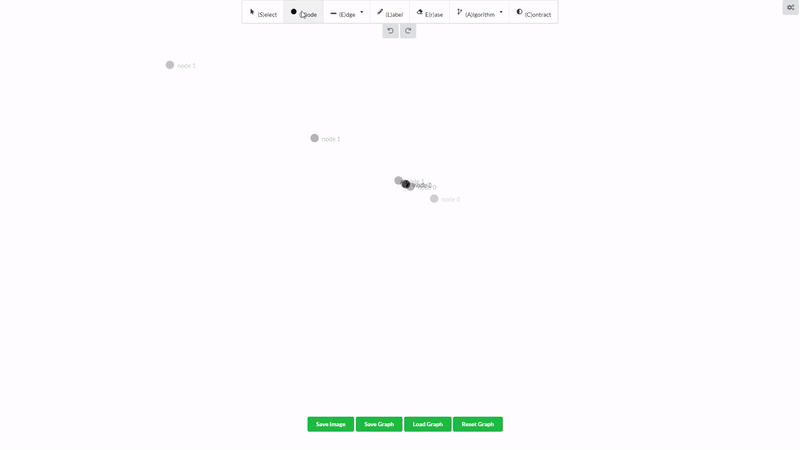

# Graf
An intuitive, open-source graph editor. Try it [here](https://graf-foundation.github.io/Graf/)! ⚠️ Under construction ⚠️



## Installation
First, install [Node.js](https://nodejs.org/en/).
Clone the repository and navigate to `Graf/Vue/graf` in the command line.
### Dependencies
To install the dependencies, type the following:
```bash
npm install
```
### Run for development
```bash
npm run serve
```

### Build for production
```bash
npm run build
```

### Linting
```bash
npm run lint
```

## License
[MIT](https://choosealicense.com/licenses/mit/)
