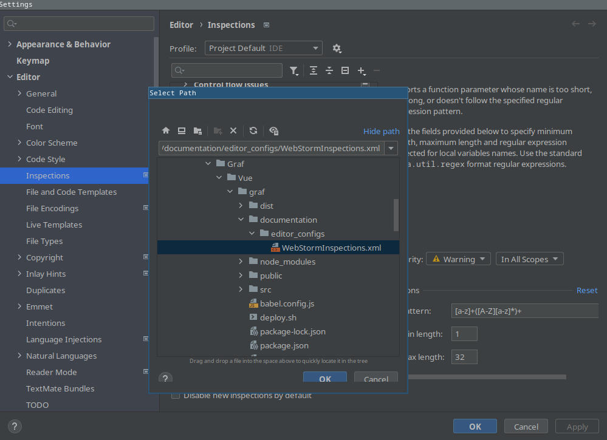

# Naming Conventions

## General Rules

*  No numbers or special characters in names (excepting underscores)
*  No 1 letter variable names / magic numbers
*  Try to make names descriptive and somewhat concise

## File Names

### Code Files:
    PascalCase.js


### Asset Files:
    lowercase.png

## JavaScript

### Class Names:
```JavaScript
class PascalCase {}
```
### Function Names:
```JavaScript
function camelCase() {}
```

### Function Params:
```JavaScript
function f(under_scored_lower) {}
```
### Local Variables:
```JavaScript
var under_scored_lower = 0
```

## HTML

### Div Id / Class Names:
```HTML
<div id="hyphen-lower"></div>
```

## Vue

### Component Names:
```vue
<script>
  export default { name: "PascalCase" }
</script>
```

### Event Names:
```vue
<script>
  this.$emit('hyphen-lower');
</script>
```
    

# Adding to your IDE

### You can find IDE config files for naming conventions in documentation/editor_configs

## WebStorm

__To Import:__ File > Settings > Editor > Inspections > Click the Gear > Import Profile


